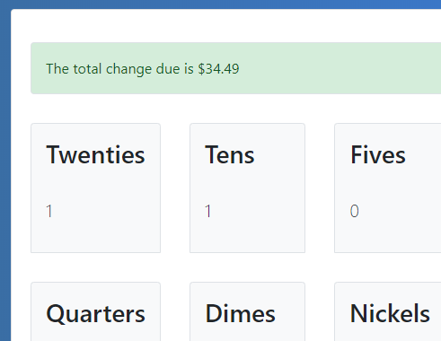

## REACT100 - Change Calculator
My objective for this project was to revisit my old change calculator from the WEB101 course and modify it from vanilla JavaScript to use React. This meant creating a component to manage the state for the various currencies, and changing the structure of the DOM to use React's virtual DOM. This version also introduced me to using Bootstrap for styling. I was able to reuse the logic portion from my old change calculator. 

### App Screenshot

